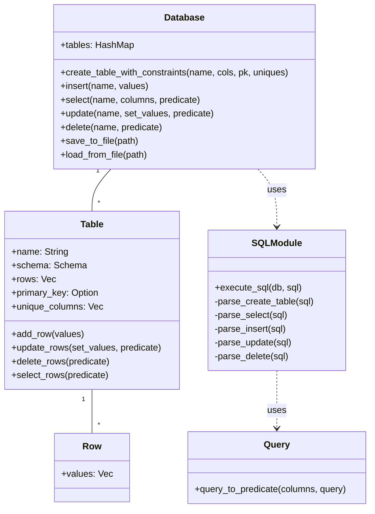

# UML Diagram for Rust In-Memory Database

Below is a simple UML class diagram representing the main components of the project (module names reflect the `src/` layout):

- `Database` manages multiple `Table`s and exposes a public interface in `src/database.rs`.
- `Table` contains schema information (`Schema`, `ColumnSchema`, `ColumnType`) and enforces constraints.
- `Row` stores values as strings (the typed behavior is enforced at Table operations).
- `SQLModule` (`src/sql.rs`) contains the public `execute_sql` dispatcher; its parsing helpers are internal.
- `Query` (`src/query.rs`) builds typed predicates for WHERE clauses.

