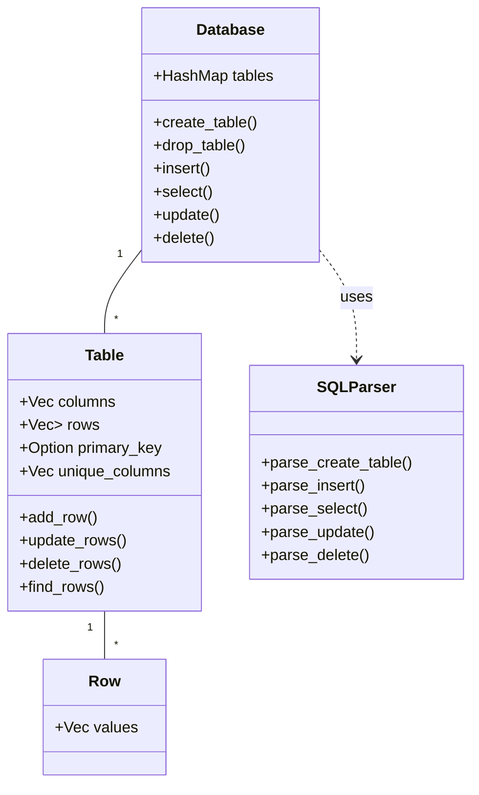

# UML Diagram for Rust In-Memory Database

Below is a simple UML class diagram representing the main components of the project:

```mermaid
classDiagram
    class Database {
        +HashMap<String, Table> tables
        +create_table()
        +drop_table()
        +insert()
        +select()
        +update()
        +delete()
    }
    class Table {
        +Vec<String> columns
        +Vec<Vec<String>> rows
        +Option<String> primary_key
        +Vec<String> unique_columns
        +add_row()
        +update_rows()
        +delete_rows()
        +find_rows()
    }
    class Row {
        +Vec<String> values
    }
    class SQLParser {
        +parse_create_table()
        +parse_insert()
        +parse_select()
        +parse_update()
        +parse_delete()
    }
    Database "1" -- "*" Table
    Table "1" -- "*" Row
    Database ..> SQLParser : uses
```

- `Database` manages multiple `Table` objects and provides CRUD operations.
- `Table` stores rows, column info, and constraint metadata.
- `Row` represents a single record.
- `SQLParser` parses SQL-like queries and is used by `Database`.

